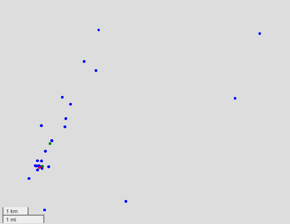

# pocketmap

Manage your saved coordinates locally

## Problem
I want to save coordinates data, whether it's places that i've visited or someone's address. Back then, i'm using Google Maps, or QGIS to store this data, but i'm quite unsatisfied.  

